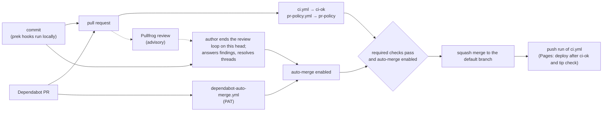
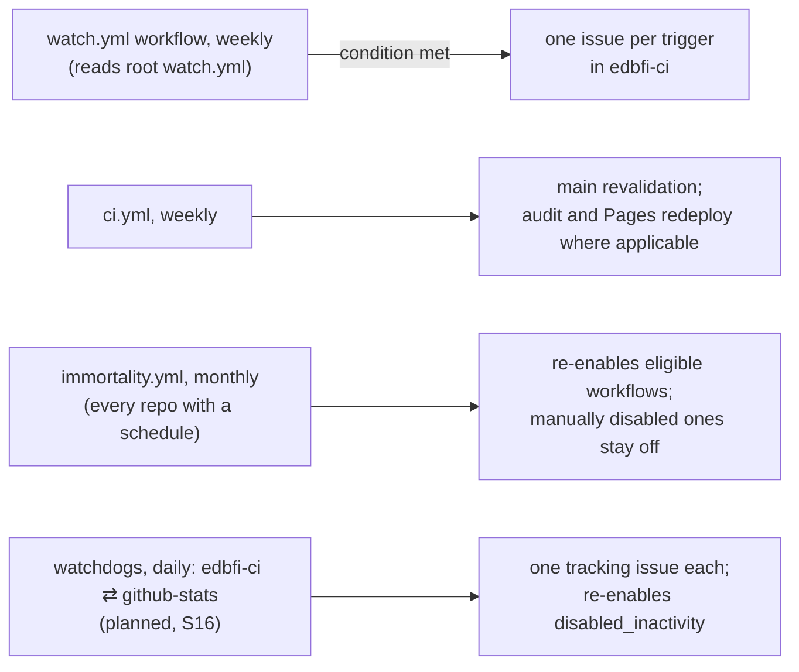
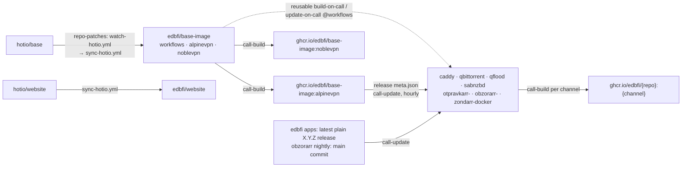

# edbfi-ci

The single source of truth for CI across the edbfi repos: the design every repo's CI follows, the rollout state, the shared prek hooks and workflow templates. The full core CI runs here; the target repos get it one rollout step at a time, and [STATE.md](STATE.md) shows how far that has got.

## Principles

1. **No human in the loop** where automation can do it safely. Accepted exceptions: manual Bun updates until Dependabot supports `bun.lock` v2 (B1, D3); dox (private, Free plan: manual merges); replex (manual merges until its CI is green).
2. **No holds:** no Dependabot `ignore:` entries, pinned-back versions or hand-lifted allowlists; a broken upstream release keeps its PR red until a later release fixes it.
3. **Future-proof over here-and-now:** build what the known next state needs if it is safe while idle; upstream follow-ups are watch entries, with manual conditions and exceptions stated explicitly.
4. **Upstream mechanisms over custom code:** use Dependabot, GitHub and prek; custom code covers only what nothing upstream does, in one copy, here.
5. **Precise, self-cleaning documentation:** see [AGENTS.md](AGENTS.md#working-model).

## Files

| Path | Holds |
|---|---|
| [AGENTS.md](AGENTS.md) | working model and environment for agents (`CLAUDE.md` imports it) |
| [STATE.md](STATE.md) | rollout steps, per-repo status, current GitHub state, open items |
| [DECISIONS.md](DECISIONS.md) | resolved decisions and blockers, with what enforces each |
| [MAINTENANCE.md](MAINTENANCE.md) | the cleanup gate that ends every step |
| [watch.yml](watch.yml) | upstream conditions and follow-up actions |
| [design/](design/) | normative rules, one module per topic |
| [tools/doc_guard](tools/doc_guard/doc_guard.py) | documentation guards, run by prek and CI |
| [hooks/](hooks/) · [hook manifest](.pre-commit-hooks.yaml) | shared CI policy hooks and their tests |
| [templates/](templates/) | workflow, Dependabot and hook starting points; rollout adaptations in [repos.md](design/repos.md) |
| [.pre-commit-config.yaml](.pre-commit-config.yaml) · [.github/](.github/) | this repo's hooks, CI and Dependabot config |

Design modules: [ci](design/ci.md) · [prek](design/prek.md) · [dependabot](design/dependabot.md) · [auto-merge](design/auto-merge.md) · [pr-policy](design/pr-policy.md) · [settings](design/settings.md) · [security](design/security.md) · [biome](design/biome.md) · [watchdog](design/watchdog.md) · [d8](design/d8.md) · [repos](design/repos.md).

## How a change lands

The normal path in a rolled-out repo; replex and dox use the exceptions in [auto-merge.md](design/auto-merge.md#contract).

## Scheduled automation

## Hotio image family

Outside the rollout tiers, the docker repos follow Hotio's own workflows ([repos.md](design/repos.md#contract) rules 7-9).

Before local Python checks, install the locked development environment using the setup command in [CI](.github/workflows/ci.yml). The [prek config](.pre-commit-config.yaml) runs basedpyright and the [typing config guard](tools/check_basedpyright_config.py).

## License

[AGPL-3.0-only](LICENSE).
